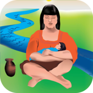

# MDR Original

> Old, deprecated version of the code.

## DEPRECATED

This is the older, deprecated version of the code supporting the MDR project.
For the current version, please [see
here](https://github.com/srsudar/MamasDelRioAndroid/).

## Overview

Mamás del Río is a project to provide support to mothers living in rural
villages in the Peruvian Amazon. One component of the project is a way for
community agents to communicate with doctors and global health researchers in
Lima. This is the code for the Android app that facilitates communication
between the villagers and the researchers.

